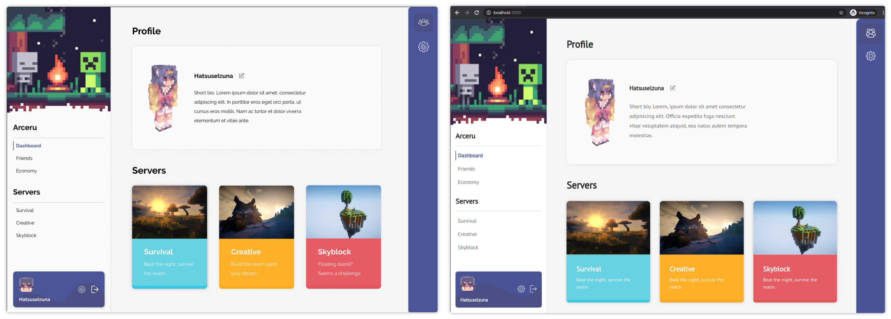

# Three of something
Small repo to keep source code of "design to code" challenge that I did.

## First

Left one is the initial design that [my friend](https://www.facebook.com/erst.madatayadih) made. The right one is my implementation. I don't have all of the assets that he uses so I use my own. Though it's basically the same, just some minor differences.

## Second

Left one is the initial design that [my friend](https://github.com/NikarashiHatsu) made. The right one is my implementation. I was having fun while making this.
